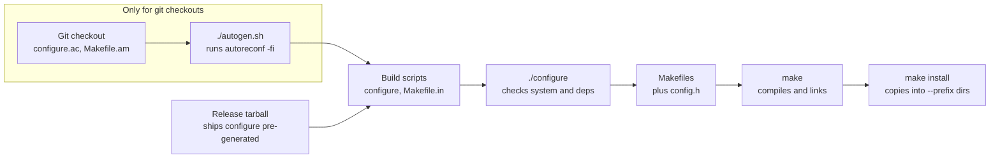

# Building Linux Applications from Source

*Last updated: September 27, 2026*

## Contents

1. [Why build from source](#why-build-from-source)
2. [Prerequisites: the build toolchain](#prerequisites-the-build-toolchain)
3. [Anatomy of a source tarball](#anatomy-of-a-source-tarball)
4. [How GNU Autotools builds work](#how-gnu-autotools-builds-work)
5. [Running configure](#running-configure)
6. [Dependency management](#dependency-management)
7. [Compiling with make](#compiling-with-make)
8. [Installing to custom paths](#installing-to-custom-paths)
9. [Worked example: tmux and libevent in your home directory](#worked-example-tmux-and-libevent-in-your-home-directory)
10. [Other build systems](#other-build-systems)
11. [Managing and uninstalling source builds](#managing-and-uninstalling-source-builds)
12. [Troubleshooting common build errors](#troubleshooting-common-build-errors)
13. [Quick reference](#quick-reference)

## Why build from source

Building from source gets you the exact version, features and install location you want. In exchange, you take over the package manager's job: dependencies, updates and clean removal.

Build from source when you have a specific reason:

- Your distribution ships an older release than you need, which is common on LTS and enterprise distros.
- You need a compile-time feature the distro build left out, or want to remove one.
- You don't have root access, so you install into your home directory.
- You are patching, debugging or developing the software itself.
- You need several versions side by side, such as two releases of a compiler.

What you give up:

- **Security updates.** Nothing updates a source build; you track upstream releases yourself.
- **Dependency tracking.** Removing or upgrading a library can silently break a program linked against it.
- **Clean removal.** Files copied into `/usr/local` are hard to find later unless you plan for it (see [Managing and uninstalling](#managing-and-uninstalling-source-builds)).

Rule of thumb: use the package manager by default, and never install a source build into `/usr`, which belongs to the package manager. Commands in this tutorial use bash; only steps that write outside your home directory need `sudo`.

## Prerequisites: the build toolchain

One command per distribution installs everything this tutorial uses: a C/C++ compiler, `make`, the GNU Autotools and `pkg-config`.

| Distribution | Install command |
| --- | --- |
| Debian, Ubuntu, Mint | `sudo apt install build-essential autoconf automake libtool pkg-config` |
| Fedora, RHEL, Rocky, Alma | `sudo dnf install gcc gcc-c++ make autoconf automake libtool pkgconf-pkg-config` |
| Arch, Manjaro | `sudo pacman -S --needed base-devel` |
| openSUSE | `sudo zypper install -t pattern devel_basis` |
| Alpine | `sudo apk add build-base autoconf automake libtool pkgconf` |

What each tool does:

- **gcc / g++** compile C and C++; `clang` works as a drop-in alternative.
- **make** runs the build steps described in a `Makefile`.
- **binutils** (pulled in automatically) provides the linker `ld`, plus `ar`, `strip` and `readelf`.
- **autoconf, automake, libtool** regenerate `configure` scripts. Release tarballs rarely need them; git checkouts always do.
- **pkg-config** (or its drop-in `pkgconf`) tells builds where libraries and headers live.

For other build systems, add `cmake`, `meson` and `ninja` (Debian/Ubuntu: `ninja-build`). Many projects also need `bison`, `flex` or `gettext`, and their README will say so.

Confirm the toolchain works:

```bash
gcc --version
make --version
pkg-config --version
```

## Anatomy of a source tarball

A release tarball is a compressed archive of the source tree, usually named `name-version.tar.xz` or `.tar.gz`. Download it, verify it, extract it, then read what's inside before building anything.

### Download

Keep all sources under one directory so you can find build trees again later. GNU Hello is a small package that is handy for practice.

```bash
mkdir -p ~/src && cd ~/src
wget https://ftp.gnu.org/gnu/hello/hello-2.12.1.tar.gz
wget https://ftp.gnu.org/gnu/hello/hello-2.12.1.tar.gz.sig
```

Prefer the project's official release page over mirrors of unknown origin. On GitHub, use the files attached to a release, not the auto-generated "Source code" archive: the latter is a raw git snapshot and often lacks the `configure` script.

### Verify

A checksum proves the file wasn't corrupted; a GPG signature proves the maintainer produced it. Check whichever the project publishes, ideally both.

```bash
# Checksum: compare against the value on the project's site
sha256sum hello-2.12.1.tar.gz

# Or let sha256sum compare against a published checksum file
sha256sum -c SHA256SUMS --ignore-missing

# Signature: fetch the signer's key, then verify
wget https://ftp.gnu.org/gnu/gnu-keyring.gpg
gpg --verify --keyring ./gnu-keyring.gpg hello-2.12.1.tar.gz.sig hello-2.12.1.tar.gz
```

Look for `Good signature from ...`. A warning that the key is "not certified with a trusted signature" is normal unless you have signed that key yourself. `BAD signature` means stop and delete the file.

### Extract

GNU tar detects the compression format on its own, so `tar -xf file` works for every tarball below.

| Extension | Compression | Explicit extract command |
| --- | --- | --- |
| `.tar.gz`, `.tgz` | gzip | `tar -xzf file.tar.gz` |
| `.tar.bz2`, `.tbz2` | bzip2 | `tar -xjf file.tar.bz2` |
| `.tar.xz`, `.txz` | xz | `tar -xJf file.tar.xz` |
| `.tar.zst` | zstd | `tar --zstd -xf file.tar.zst` |
| `.zip` | zip | `unzip file.zip` |

List the contents first with `tar -tf file | head`. A well-formed tarball unpacks into one top-level directory; if it doesn't, extract it into its own directory with `mkdir x && tar -xf file -C x`.

```bash
tar -xf hello-2.12.1.tar.gz
cd hello-2.12.1
ls
```

### What's inside

The files at the top of the tree tell you which build system the project uses and whether its build scripts are already generated.

| File | What it is | What to do |
| --- | --- | --- |
| `README`, `INSTALL` | Build instructions and dependency list | Always read first; GNU `INSTALL` files are often generic |
| `NEWS`, `ChangeLog` | Changes per release | Check before upgrading |
| `COPYING`, `LICENSE` | License terms | - |
| `configure` | Generated shell script that probes your system and writes Makefiles | Run it: `./configure` |
| `configure.ac` | Autoconf source that `configure` is generated from | Without `configure` next to it, generate it first |
| `Makefile.am` | Automake source for `Makefile.in` | Same as above |
| `Makefile.in` | Template that `configure` fills in to produce `Makefile` | Nothing; `configure` uses it |
| `autogen.sh`, `bootstrap` | Script that runs the Autotools to generate `configure` | Run it only when `configure` is missing |
| `config.h.in` | Header template for compile-time settings | Nothing |
| `m4/`, `aclocal.m4` | Autoconf macro files | Nothing |
| `CMakeLists.txt` | CMake project | See [Other build systems](#other-build-systems) |
| `meson.build` | Meson project | See [Other build systems](#other-build-systems) |
| `Makefile` only | Hand-written Makefile, no configure step | Read it, then `make` |

The name of the bootstrap script varies: `autogen.sh`, `bootstrap`, `bootstrap.sh` or occasionally `autogen`. If `configure.ac` is present but no such script exists, `autoreconf -fi` does the same job.

## How GNU Autotools builds work

Most C and C++ projects on Linux use the GNU Autotools, and building them ends with the same three commands: `./configure`, `make`, `make install`.



A release tarball ships `configure` already generated, so you start at `./configure`. A git checkout ships only the sources (`configure.ac`, `Makefile.am`), so you run `./autogen.sh` first.

### The standard sequence

```bash
./configure            # probe the system, choose options, write Makefiles
make -j"$(nproc)"      # compile using every CPU core
make check             # optional: run the test suite
sudo make install      # copy files into the prefix (default /usr/local)
```

Each step has one job:

- **`./configure`** checks for a compiler, headers, libraries and features, then writes a `Makefile` in each directory plus `config.h`. It also leaves `config.log`, a record of every check, and `config.status`, which can regenerate the output.
- **`make`** compiles and links inside the source or build tree. Nothing outside that tree changes.
- **`make install`** copies binaries, libraries, headers, man pages and data into the directories chosen at configure time. It is the only step that may need `sudo`.

### When you need autogen.sh

Run the bootstrap script only when `configure` is missing, typically after `git clone`. It calls `autoreconf`, which runs `aclocal`, `autoconf`, `autoheader`, `automake` and `libtoolize` in the right order.

```bash
./autogen.sh           # or ./bootstrap, or: autoreconf -fiv
./configure --prefix=/usr/local
```

The `autoreconf` flags mean: `-f` regenerate everything, `-i` copy in missing helper files, `-v` print each step. Some `autogen.sh` scripts run `./configure` at the end; pass your options to the script, or set `NOCONFIGURE=1` where the script supports it (a common GNOME convention).

Two cautions:

- Don't regenerate `configure` in a release tarball. Your Autotools version may differ from the maintainer's and break a working script.
- Bootstrapping needs more than autoconf and automake. A missing `pkg-config`, `libtool` or `gettext` shows up as errors like `possibly undefined macro: PKG_CHECK_MODULES`.

## Running configure

`./configure --help` lists every option a package accepts, so read it before your first build. Most builds need only `--prefix` plus a few feature switches.

```bash
./configure --help | less
./configure --help=short    # only the package's own options, if supported
```

### Installation directory options

Every directory derives from `--prefix`, so setting it alone is usually enough. Override the others only when a program must follow a specific layout, such as a daemon reading config from `/etc`.

| Option | Default | Holds |
| --- | --- | --- |
| `--prefix` | `/usr/local` | Root of everything below |
| `--exec-prefix` | same as prefix | Architecture-specific files |
| `--bindir` | `PREFIX/bin` | User programs |
| `--sbindir` | `PREFIX/sbin` | Admin programs |
| `--libdir` | `PREFIX/lib` | Libraries and `pkgconfig/` files |
| `--includedir` | `PREFIX/include` | C/C++ headers |
| `--datarootdir` | `PREFIX/share` | Architecture-independent data |
| `--mandir` | `PREFIX/share/man` | Man pages |
| `--sysconfdir` | `PREFIX/etc` | Configuration files |
| `--localstatedir` | `PREFIX/var` | Logs, caches, state |

A typical daemon build keeps its binaries in the prefix but puts config and state in the usual system places:

```bash
./configure --prefix=/usr/local --sysconfdir=/etc --localstatedir=/var
```

### Feature options

Autoconf uses two option families, and `--help` lists which ones a package supports.

- `--enable-FEATURE` / `--disable-FEATURE` switch optional parts of the package itself, such as `--disable-nls` (no translations) or `--enable-debug`.
- `--with-PACKAGE` / `--without-PACKAGE` choose whether to use an external library. Many accept a path, as in `--with-openssl=/opt/openssl`.
- Libtool packages add `--enable-shared` and `--disable-static` to choose which kinds of library to build.

```bash
./configure --prefix=/opt/myapp --disable-static --without-x --enable-debug
```

The options above are illustrative; exact names differ per package. An unknown option only prints a warning, so a typo can silently do nothing. Check the summary configure prints at the end.

### Environment variables configure honours

Pass these as arguments after `./configure`, not with `export`. Configure then records them in `config.status`, so later automatic re-runs keep them.

| Variable | Purpose | Example |
| --- | --- | --- |
| `CC`, `CXX` | C and C++ compiler | `CC=clang CXX=clang++` |
| `CFLAGS`, `CXXFLAGS` | Compiler flags | `CFLAGS="-O2 -g"` |
| `CPPFLAGS` | Preprocessor flags, extra header dirs | `CPPFLAGS="-I/opt/foo/include"` |
| `LDFLAGS` | Linker flags, extra library dirs | `LDFLAGS="-L/opt/foo/lib"` |
| `LIBS` | Extra libraries to link | `LIBS="-lm"` |
| `PKG_CONFIG_PATH` | Extra dirs searched for `.pc` files | `PKG_CONFIG_PATH=/opt/foo/lib/pkgconfig` |

```bash
./configure --prefix="$HOME/.local" CC=clang CFLAGS="-O2 -march=native"
```

`-march=native` tunes the binary for your CPU; it may not run on older machines.

### Out-of-tree builds

Most Autotools packages can build in a separate directory, which keeps the source tree clean. You can then keep several configurations side by side, such as a debug and a release build.

```bash
mkdir build-release && cd build-release
../configure --prefix=/usr/local
make -j"$(nproc)"
```

If the source tree was already configured in place, run `make distclean` there first, or the out-of-tree configure will refuse to run.

### Reading configure output and config.log

Configure prints one `checking ...` line per test and stops at the first fatal one. The terminal message is a summary; `config.log` holds the exact compiler command and error for every check.

```bash
head -n 10 config.log              # the exact command line you ran
grep -n 'error' config.log | tail  # the checks that failed, last ones matter most
```

The most common failure reads like `Package requirements (libfoo >= 1.2) were not met`, which means a missing development package; the next section covers the fix. To start over with different options, run `make distclean`, then configure again.

## Dependency management

Most build failures are missing dependencies, and the fix is usually a library's development package rather than the library itself. Work out what a package needs before you run configure, not one error at a time.

### Runtime packages vs development packages

A program needs a library's shared object (`libfoo.so.1`) to run. Building against it also needs the headers, the unversioned `libfoo.so` link and the `foo.pc` pkg-config file. Most distributions split these into a separate development package.

| Distribution | Naming pattern | Example for libevent |
| --- | --- | --- |
| Debian, Ubuntu | `libfoo-dev` | `libevent-dev` |
| Fedora, RHEL | `foo-devel` | `libevent-devel` |
| openSUSE | `foo-devel` | `libevent-devel` |
| Arch | headers ship in the main package | `libevent` |
| Alpine | `foo-dev` | `libevent-dev` |

### Finding what a package needs

Work through these in order, cheapest first:

1. **Read `README` and `INSTALL`.** Most projects list required and optional libraries with minimum versions.
2. **Scan the build definition.** Every dependency configure checks for appears in `configure.ac`.

   ```bash
   grep -nE 'PKG_CHECK_MODULES|AC_CHECK_LIB|AC_SEARCH_LIBS|AC_CHECK_HEADERS?' configure.ac
   ```

3. **Borrow the distro's list.** If your distribution packages the program, install the build dependencies of its version. A newer upstream release may need a little more.
4. **Let configure tell you.** Run it, install whatever it reports missing, and repeat.

| Distribution | Install a packaged program's build dependencies |
| --- | --- |
| Debian, Ubuntu | `sudo apt build-dep tmux` (needs `deb-src` entries enabled in your APT sources) |
| Fedora, RHEL | `sudo dnf builddep tmux` (from `dnf-plugins-core`) |
| openSUSE | `sudo zypper source-install --build-deps-only tmux` |
| Arch | Read `depends` and `makedepends` in the package's PKGBUILD |

### Finding which package provides a missing file

When configure names a file or a pkg-config module, ask the package manager who ships it. Fedora and openSUSE can even install by pkg-config name directly.

| Distribution | Search by file | Install by pkg-config name |
| --- | --- | --- |
| Debian, Ubuntu | `apt-file search libevent.pc` (run `sudo apt-file update` once) | - |
| Fedora, RHEL | `dnf provides '*/libevent.pc'` | `sudo dnf install 'pkgconfig(libevent)'` |
| openSUSE | `zypper search --provides 'pkgconfig(libevent)'` | `sudo zypper install 'pkgconfig(libevent)'` |
| Arch | `pacman -F libevent.pc` (run `sudo pacman -Fy` once) | - |

### How configure finds libraries: pkg-config

Most modern libraries install a `.pc` file describing their version, header path and linker flags. Configure asks `pkg-config` for these rather than guessing.

```bash
pkg-config --modversion libevent          # installed version
pkg-config --cflags --libs libevent       # flags a build would use
pkg-config --variable pc_path pkg-config  # default search directories
pkg-config --list-all | grep -i event     # everything pkg-config can see
```

`No package 'libevent' found` means one of two things. Either the development package isn't installed, or the `.pc` file sits in a custom prefix that isn't on `PKG_CONFIG_PATH`.

### Building a dependency from source

When the distro's version of a library is too old, build the library first into a prefix, then point the application at it. Always build bottom-up: dependencies before the programs that use them.

```bash
DEPS="$HOME/.local"

# 1. Build and install the library
cd ~/src/libfoo-2.0
./configure --prefix="$DEPS"
make -j"$(nproc)" && make install

# 2. Build the application against it
cd ~/src/app-1.0
PKG_CONFIG_PATH="$DEPS/lib/pkgconfig" ./configure --prefix="$DEPS" \
    CPPFLAGS="-I$DEPS/include" \
    LDFLAGS="-L$DEPS/lib -Wl,-rpath,$DEPS/lib"
```

- `PKG_CONFIG_PATH` covers libraries that ship `.pc` files; `CPPFLAGS` and `LDFLAGS` cover the ones that don't.
- `-Wl,-rpath` records the library directory inside the binary so it can find the library at run time. [Installing to custom paths](#installing-to-custom-paths) explains the alternatives.
- Check where the library actually landed with `ls "$DEPS"`. Some builds install into `lib64` instead of `lib`, and the paths above must match.

For long chains, list the dependency tree first and build it from the leaves up. If the chain grows past three or four libraries, a dedicated tool such as Spack, or a container with a newer distribution, may save you time.

## Compiling with make

`make -j"$(nproc)"` compiles on every CPU core at once and is the right default. The rest of this section is about reading what make tells you when something breaks.

```bash
make -j"$(nproc)"                      # parallel build
make -j"$(nproc)" 2>&1 | tee build.log # same, keeping a log
make check                             # run the test suite, if there is one
```

### Useful make targets

| Target | What it does |
| --- | --- |
| `all` (default) | Build everything |
| `check` | Run the test suite (Autotools convention; some projects use `test`) |
| `install` | Copy files into the configured prefix |
| `install-strip` | Install with debug symbols stripped, for smaller binaries |
| `uninstall` | Remove what `install` copied (Autotools; needs the same configured tree) |
| `clean` | Delete compiled objects, keep the configuration |
| `distclean` | Also delete everything configure generated |

### Seeing the real commands

Automake's silent rules print short lines like `CC main.o` instead of full compiler commands. Turn them off when you need to see the exact flags.

```bash
make V=1          # Autotools projects
make VERBOSE=1    # CMake-generated Makefiles
```

### Reading build errors

The last line of a failed build is usually `make: *** [...] Error 1`, which only says something failed. The cause is the first line containing `error:` above it.

1. Rerun with plain `make` (no `-j`). Parallel jobs interleave output, and a serial run stops right at the failure.
2. Search the log for the first error: `grep -n 'error:' build.log | head`.
3. Match it against the [troubleshooting table](#troubleshooting-common-build-errors): `fatal error: foo.h: No such file` and `cannot find -lfoo` are missing development packages.

Warnings are normal in most projects and can be ignored unless the build fails. Don't add `-Werror` unless you intend to fix them.

### Don't run make as root

Only `make install` into a root-owned prefix needs `sudo`. Running the compile step as root leaves root-owned files in your build tree and runs the project's build scripts with full privileges. If it already happened, fix ownership with `sudo chown -R "$USER": .` inside the tree.

## Installing to custom paths

The prefix decides who can install the program, who can run it and how easily you can remove it. Choose it before you run configure: many programs compile their data and config paths into the binary, so moving files afterwards breaks them.

### Choosing a prefix

| Prefix | Needs root | Available to | Best for |
| --- | --- | --- | --- |
| `$HOME/.local` | No | You only | Personal tools, machines where you lack root |
| `/usr/local` (default) | Yes | All users, already on `PATH` | System-wide installs of a single version |
| `/opt/NAME` or `/opt/NAME-VERSION` | Yes | All users, after a `PATH` change | Self-contained apps, several versions side by side |
| `/usr/local/stow/NAME-VERSION` | Yes | All users, via symlinks | Easy uninstall and upgrades (see [Managing and uninstalling](#managing-and-uninstalling-source-builds)) |
| `/usr` | Yes | All users | Never: it belongs to the package manager |

```bash
./configure --prefix="$HOME/.local"     # no sudo needed for make install
./configure --prefix=/opt/tmux-3.5a     # one directory per version
```

### Making the shell find programs outside the default paths

Add the prefix to your environment in `~/.bashrc` (or `~/.zshrc`). Many distributions already put `~/.local/bin` on `PATH` once the directory exists.

```bash
PREFIX="$HOME/.local"
export PATH="$PREFIX/bin:$PATH"
export PKG_CONFIG_PATH="$PREFIX/lib/pkgconfig:$PREFIX/share/pkgconfig${PKG_CONFIG_PATH:+:$PKG_CONFIG_PATH}"
export CMAKE_PREFIX_PATH="$PREFIX${CMAKE_PREFIX_PATH:+:$CMAKE_PREFIX_PATH}"
```

- **PATH order matters.** Putting the prefix first lets your build override the distro's copy. After installing, run `hash -r` so bash forgets old locations, then check with `command -v tmux`.
- **Man pages usually just work.** `man` derives `PREFIX/share/man` from each `PREFIX/bin` on your `PATH`. If it doesn't, set `export MANPATH="$PREFIX/share/man:"`; the trailing colon keeps the system pages too.
- **pkg-config and CMake paths** let later source builds find libraries you installed into this prefix.

### Making programs find shared libraries

A program linked against a library in a custom prefix may build fine and then fail at launch:

```
tmux: error while loading shared libraries: libevent_core-2.1.so.7: cannot open shared object file: No such file or directory
```

The dynamic loader only searches certain places, in this order:

1. Paths recorded in the binary itself (`RPATH` or `RUNPATH`)
2. Directories in `LD_LIBRARY_PATH`
3. The cache built by `ldconfig` from `/etc/ld.so.conf` and `/etc/ld.so.conf.d/*.conf`
4. The default system directories, such as `/lib` and `/usr/lib`

Pick one of three fixes, depending on who installs and who runs the program:

| Fix | How | Best for |
| --- | --- | --- |
| Register the directory with the loader | `echo /opt/foo/lib \| sudo tee /etc/ld.so.conf.d/foo.conf && sudo ldconfig` | System-wide prefixes |
| Record an rpath at link time | Add `LDFLAGS="-Wl,-rpath,$PREFIX/lib"` to configure | Home-directory installs and self-contained apps |
| Set `LD_LIBRARY_PATH` | `export LD_LIBRARY_PATH="$PREFIX/lib"` | Quick tests only; it affects every program you start |

Debian and Ubuntu list `/usr/local/lib` in the loader configuration already; Fedora and RHEL don't. Either way, run `sudo ldconfig` after installing new libraries into a system directory.

Check the result:

```bash
ldd "$(command -v tmux)"                       # where each library resolves
readelf -d "$(command -v tmux)" | grep -E 'RPATH|RUNPATH'  # recorded paths
```

### Staged installs with DESTDIR

`DESTDIR` copies the install into a staging directory without changing the prefix. Use it to preview what `make install` would write, or to feed files into a packaging tool.

```bash
make DESTDIR="$PWD/stage" install
find stage -type f | sort       # e.g. stage/usr/local/bin/tmux
```

`DESTDIR` is not a substitute for `--prefix`. The staged files still expect to run from the prefix, so copying them anywhere else can break them.

### Changing the prefix later

Don't move installed files. Uninstall, reconfigure and rebuild instead:

```bash
sudo make uninstall
make distclean
./configure --prefix=/opt/newplace
make -j"$(nproc)" && sudo make install
```

## Worked example: tmux and libevent in your home directory

This example builds tmux and its libevent dependency from source into `~/.local`, with no root needed after the toolchain is installed. It uses every idea above: a dependency built from source, a custom prefix, `PKG_CONFIG_PATH` and an rpath.

tmux needs two libraries: libevent 2.x and ncurses. We take ncurses from the distribution and build libevent ourselves, the usual case when a distro's copy is too old. The versions below are known-good; substitute the current releases from each project's releases page.

### Step 1: tools and the distro-provided dependency

```bash
# Debian / Ubuntu
sudo apt install build-essential pkg-config bison libncurses-dev wget

# Fedora / RHEL
sudo dnf install gcc make pkgconf-pkg-config bison ncurses-devel wget

# Arch
sudo pacman -S --needed base-devel ncurses wget
```

`bison` provides the `yacc` parser generator tmux needs to build.

### Step 2: set up the prefix and workspace

```bash
export PREFIX="$HOME/.local"
export PKG_CONFIG_PATH="$PREFIX/lib/pkgconfig"
mkdir -p ~/src && cd ~/src
```

### Step 3: build libevent

```bash
wget https://github.com/libevent/libevent/releases/download/release-2.1.12-stable/libevent-2.1.12-stable.tar.gz
tar -xf libevent-2.1.12-stable.tar.gz
cd libevent-2.1.12-stable

./configure --prefix="$PREFIX" --disable-openssl
make -j"$(nproc)"
make install        # no sudo: the prefix is yours
cd ..
```

`--disable-openssl` skips libevent's optional TLS support, which tmux doesn't use. Confirm pkg-config now sees your copy:

```bash
pkg-config --modversion libevent    # 2.1.12-stable
pkg-config --variable=libdir libevent   # /home/you/.local/lib
```

### Step 4: build tmux against it

```bash
wget https://github.com/tmux/tmux/releases/download/3.5a/tmux-3.5a.tar.gz
tar -xf tmux-3.5a.tar.gz
cd tmux-3.5a

./configure --prefix="$PREFIX" LDFLAGS="-Wl,-rpath,$PREFIX/lib"
make -j"$(nproc)"
make install
```

The release tarball already contains `configure`, so there is no `autogen.sh` step. The rpath lets tmux find `libevent` in `~/.local/lib` at run time without `LD_LIBRARY_PATH`.

If configure stops with a message such as `libevent not found` or `curses not found`, check `PKG_CONFIG_PATH` and the ncurses development package from step 1.

### Step 5: verify

```bash
export PATH="$PREFIX/bin:$PATH"   # add to ~/.bashrc to keep it
hash -r

command -v tmux                  # /home/you/.local/bin/tmux
tmux -V                          # tmux 3.5a
ldd "$(command -v tmux)" | grep event   # libevent_core... => /home/you/.local/lib/...
man tmux                         # man page from ~/.local/share/man
```

If `ldd` shows the libevent path as `not found`, the rpath didn't take effect. Rebuild with `make distclean`, then repeat step 4, and check the `LDFLAGS` quoting.

### Variation: building from a git checkout

A git clone has no `configure`, so generate it first. This needs `autoconf` and `automake` from the prerequisites.

```bash
git clone https://github.com/tmux/tmux.git
cd tmux
sh autogen.sh
./configure --prefix="$PREFIX" LDFLAGS="-Wl,-rpath,$PREFIX/lib"
make -j"$(nproc)" && make install
```

### Removing it

Keep both build trees in `~/src`, and removal is two commands:

```bash
cd ~/src/tmux-3.5a && make uninstall
cd ~/src/libevent-2.1.12-stable && make uninstall
```

## Other build systems

CMake and Meson follow the same configure, build, install cycle as Autotools, with different commands. Both always build out of tree, in a `build/` directory you name.

| Step | Autotools | CMake | Meson |
| --- | --- | --- | --- |
| Recognise it | `configure` or `configure.ac` | `CMakeLists.txt` | `meson.build` |
| Configure | `./configure --prefix=P` | `cmake -S . -B build -DCMAKE_INSTALL_PREFIX=P -DCMAKE_BUILD_TYPE=Release` | `meson setup build --prefix=P --buildtype=release` |
| List options | `./configure --help` | `cmake -LH build` | `meson configure build` |
| Set an option | `--enable-foo`, `--with-bar` | `-DFOO=ON` | `-Dfoo=enabled` |
| Build | `make -j"$(nproc)"` | `cmake --build build -j` | `meson compile -C build` |
| Test | `make check` | `ctest --test-dir build` | `meson test -C build` |
| Install | `make install` | `cmake --install build` | `meson install -C build` |
| Staged install | `make DESTDIR=D install` | `DESTDIR=D cmake --install build` | `meson install -C build --destdir D` |
| Uninstall | `make uninstall` | No built-in target; see below | `ninja -C build uninstall` |
| Find deps in a custom prefix | `PKG_CONFIG_PATH`, `CPPFLAGS`, `LDFLAGS` | `-DCMAKE_PREFIX_PATH=P` | `PKG_CONFIG_PATH`, or `--pkg-config-path=P/lib/pkgconfig` |
| Record an rpath | `LDFLAGS="-Wl,-rpath,P/lib"` | `-DCMAKE_INSTALL_RPATH=P/lib` | `LDFLAGS="-Wl,-rpath,P/lib"` set before `meson setup` |

### CMake example

```bash
cmake -S . -B build \
    -DCMAKE_INSTALL_PREFIX="$HOME/.local" \
    -DCMAKE_BUILD_TYPE=Release \
    -DCMAKE_PREFIX_PATH="$HOME/.local"
cmake --build build -j"$(nproc)"
cmake --install build
```

CMake writes every installed path to `build/install_manifest.txt`, which doubles as an uninstaller: `xargs rm -v < build/install_manifest.txt`. Review the list before running it with `sudo`. Interactive option editors exist too: `ccmake build` in a terminal, `cmake-gui` on a desktop.

### Meson example

```bash
meson setup build --prefix="$HOME/.local" --buildtype=release
meson configure build              # review options
meson compile -C build
meson test -C build
meson install -C build
```

Meson uses Ninja underneath, so `ninja -C build` works in place of `meson compile`. To change options later, run `meson configure build -Dfoo=disabled`; no need to start over.

### Library directory names vary

Depending on the distribution, CMake and Meson may install libraries into `lib64` or `lib/x86_64-linux-gnu` instead of `lib`. Run `ls "$PREFIX"` after installing and adjust `PKG_CONFIG_PATH` and rpaths to match. You can also force plain `lib` with `-DCMAKE_INSTALL_LIBDIR=lib` or `--libdir=lib`.

### Plain Makefiles

Some small projects ship only a hand-written `Makefile`, with no configure step. The install location is a variable in the Makefile, usually `PREFIX` or `prefix`, that you override on the command line.

```bash
grep -niE '^(prefix|destdir)' Makefile   # find the variable names it uses
make -j"$(nproc)"
make PREFIX="$HOME/.local" install
```

Pass the same `PREFIX` to both `make` and `make install` if the program compiles paths into itself. Dependencies are whatever the README says; there is no automatic check.

Language ecosystems have their own tools: `cargo install --path . --root "$PREFIX"` for Rust, `go build` for Go, and `pip install .` in a virtual environment for Python. Their dependency handling is separate from the C library workflow in this tutorial.

## Managing and uninstalling source builds

A source build tracks nothing, so how cleanly you can remove it depends on choices made before `make install`. Pick an approach per prefix and stick with it.

| Approach | Uninstall with | Strengths | Weaknesses |
| --- | --- | --- | --- |
| Keep the build tree | `make uninstall` in that tree | Built into Autotools and Meson | Needs the same tree and options; some packages implement it poorly |
| One prefix per program (`/opt/NAME-VERSION`) | `rm -rf /opt/NAME-VERSION` | Trivial removal, versions side by side | Each program needs its own `PATH` and library entries |
| GNU Stow | `stow -D NAME-VERSION` | One directory per program, one shared `PATH`; clean upgrades | One more tool to learn; install `stow` from your distro |
| Install manifest | `xargs rm < manifest` | Works with any build system | You create and keep the manifest yourself (CMake writes one) |
| Build a real package | The package manager | Full tracking, updates, dependencies | More learning: `makepkg` on Arch, `rpmbuild`, Debian packaging |

### GNU Stow in practice

Stow installs each program into its own directory, then creates symlinks from the shared prefix into it. `/usr/local/bin/tmux` becomes a link to `/usr/local/stow/tmux-3.5a/bin/tmux`, and removing the links removes the program.

```bash
# Build into a per-package directory
./configure --prefix=/usr/local/stow/tmux-3.5a
make -j"$(nproc)"
sudo make install

# Link it into /usr/local
cd /usr/local/stow
sudo stow tmux-3.5a

# Upgrade: unlink the old version, link the new one
sudo stow -D tmux-3.5a && sudo stow tmux-3.6

# Remove completely
sudo stow -D tmux-3.5a && sudo rm -rf tmux-3.5a
```

Stow works the same way in your home directory: use `~/.local/stow/NAME` as the prefix and run `stow -t ~/.local NAME` from `~/.local/stow`.

### Recording what you did

An install you can't reproduce is hard to update. Keep the configure command with each build.

```bash
head -n 10 config.log                        # the command configure ran with
./config.status --config                     # just the options
make DESTDIR="$PWD/stage" install && (cd stage && find . -type f -o -type l) > installed-files.txt
```

The last line produces a manifest before you install for real. Paths in it start with `./`, relative to `/`.

### Updating

Nothing notifies you of new releases or security fixes. Watch each project's releases (on GitHub: Watch, then Custom, then Releases) or subscribe to its announcement list.

To update, build the new version with the same options and install it over the old one. Files the old version installed but the new one doesn't are left behind. Stow or per-version `/opt` directories avoid that, which is the main reason to use them.

## Troubleshooting common build errors

Nearly every failure falls into one of the rows below. Find the first error in the output, match it here, and apply the fix.

| Symptom | Likely cause | Fix |
| --- | --- | --- |
| `configure: error: no acceptable C compiler found in $PATH` | No compiler installed | Install the toolchain from [Prerequisites](#prerequisites-the-build-toolchain) |
| `./configure: No such file or directory` | Git checkout, or a different build system | Run `./autogen.sh` or `autoreconf -fi`; or look for `CMakeLists.txt` / `meson.build` |
| `Package requirements (foo >= 1.2) were not met` / `No package 'foo' found` | Development package missing, or its `.pc` file is outside the search path | Install `foo-dev` / `foo-devel`; or set `PKG_CONFIG_PATH` |
| `fatal error: foo.h: No such file or directory` | Headers missing | Install the development package; or add `CPPFLAGS="-I/path/include"` |
| `/usr/bin/ld: cannot find -lfoo` | Library, or its unversioned `.so` link, missing at link time | Install the development package; or add `LDFLAGS="-L/path/lib"` |
| `undefined reference to 'foo_bar'` | Wrong library version found, or a library missing from the link line | Check `pkg-config --modversion foo` and `--libs foo`; add it via `LIBS` |
| `error while loading shared libraries: libfoo.so.N` (at run time) | Library not on the loader's search path | `ldconfig`, an rpath or `LD_LIBRARY_PATH` (see [Installing to custom paths](#installing-to-custom-paths)) |
| `possibly undefined macro: PKG_CHECK_MODULES` or `AC_PROG_LIBTOOL` | `pkg-config` or `libtool` missing while bootstrapping | Install them, then rerun `autoreconf -fi` |
| `WARNING: 'automake-1.16' is missing on your system` | File timestamps changed, so make wants to regenerate Autotools files | Install automake and run `autoreconf -fi`; or re-extract the tarball fresh |
| `yacc: command not found` / `bison: not found` | Parser generator missing | Install `bison` (or `byacc`) |
| `Permission denied` during `make install` | Prefix owned by root | `sudo make install`, or choose a prefix you own |
| Old version still runs after install | `PATH` order, or bash's command cache | `hash -r`, then check `command -v prog` and `type -a prog` |
| Options seem ignored after reconfiguring | Stale configuration or object files | `make distclean`, then configure and build again |
| Build fails randomly with `-j` but works without | Missing dependency in the project's Makefiles | Build with plain `make`; report it upstream |

### When the table doesn't help

1. Rerun the failing step serially and verbosely: `make V=1` or `make VERBOSE=1`.
2. For configure failures, find the failing check in `config.log`; the real compiler error sits just above `configure: failed program was:`.
3. Search the exact error message together with the project name. Then check the project's issue tracker and mailing list, since someone has usually hit it first.
4. Try the previous release. A brand-new release sometimes breaks with a new compiler before distributions patch it.

## Quick reference

Every command from this tutorial, in the order you use them. Replace `pkg-1.0` and URLs with your package.

```bash
# --- Get, verify, extract ---------------------------------------------
wget https://example.org/pkg-1.0.tar.xz https://example.org/pkg-1.0.tar.xz.sig
gpg --verify pkg-1.0.tar.xz.sig pkg-1.0.tar.xz
tar -tf pkg-1.0.tar.xz | head          # check the layout first
tar -xf pkg-1.0.tar.xz && cd pkg-1.0

# --- Autotools ---------------------------------------------------------
./autogen.sh                           # only if ./configure is missing (or: autoreconf -fiv)
./configure --help | less
./configure --prefix="$HOME/.local"
make -j"$(nproc)"
make check
make install                           # sudo only if you don't own the prefix

# --- CMake -------------------------------------------------------------
cmake -S . -B build -DCMAKE_INSTALL_PREFIX="$HOME/.local" -DCMAKE_BUILD_TYPE=Release
cmake --build build -j"$(nproc)"
cmake --install build

# --- Meson -------------------------------------------------------------
meson setup build --prefix="$HOME/.local" --buildtype=release
meson compile -C build
meson install -C build

# --- Point builds at libraries in a custom prefix ----------------------
export PKG_CONFIG_PATH="$HOME/.local/lib/pkgconfig"
export CMAKE_PREFIX_PATH="$HOME/.local"
./configure ... LDFLAGS="-Wl,-rpath,$HOME/.local/lib"

# --- Dependencies ------------------------------------------------------
sudo apt build-dep PROGRAM             # Debian/Ubuntu (needs deb-src)
sudo dnf builddep PROGRAM              # Fedora/RHEL
sudo dnf install 'pkgconfig(foo)'      # Fedora/RHEL, by pkg-config name
pkg-config --modversion foo

# --- Diagnose ----------------------------------------------------------
less config.log
make V=1
ldd "$(command -v prog)"
readelf -d "$(command -v prog)" | grep -E 'RPATH|RUNPATH'
command -v prog; type -a prog; hash -r

# --- Stage, uninstall, stow --------------------------------------------
make DESTDIR="$PWD/stage" install
make uninstall
sudo stow NAME-VERSION                 # run inside /usr/local/stow
sudo stow -D NAME-VERSION
```
